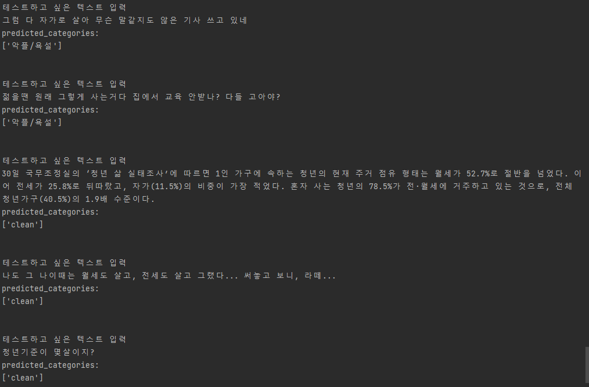

# Korean hate speech classifier based on a pretrained model

## Description
The goal of this project is to develop a korean hate speech classification model by fine-tuning a pretrained language model.   

* Pretrained model

__beomi/KcELECTRA-base-v2022__, [hugging face link](https://huggingface.co/beomi/KcELECTRA-base-v2022)


* Dataset

__smilegate-ai/kor_unsmile__, [hugging face link](https://huggingface.co/datasets/smilegate-ai/kor_unsmile)

## Installation

To install the necessary packages, run the following command in your terminal:

    pip3 install -r requirements.txt
    
We recommend installing the CUDA-enabled version of PyTorch, which can be found [here](https://pytorch.org/get-started/locally/)

## Fine-tuning & Testing

To fine-tune the pretrained model and create your own model, execute the following command:

    python train.py model.pt

After N epochs of training, this will create ```model.pt``` file that contains the trained weights.   
To resume training your model from a specific checkpoint, run the following command:

    python train.py model.pt checkpoint.pt
The resulting model will be saved in ```model.pt```.

You can test the accuracy of your model by running the following command:

    python test.py model.pt


## Result

Epoch 700번 만큼 학습한 모델로 classification report를 만들어보았다.   
```python train.py model.pt```이 명령어를 실행하면 내가 했던 방식과 동일한 방식으로 학습을 할 수 있다.


                  precision    recall  f1-score   support

       여성/가족      0.78      0.81      0.79       394
          남성       0.88      0.87      0.88       334
        성소수자      0.87      0.82      0.84       280
       인종/국적      0.84      0.75      0.80       426
          연령       0.84      0.73      0.78       146
          지역       0.89      0.87      0.88       260
          종교       0.88      0.87      0.87       290
       기타 혐오      0.00      0.00      0.00       134
       악플/욕설      0.72      0.72      0.72       786
       clean        0.82      0.78      0.80       935
       개인지칭       0.00      0.00      0.00        74

    micro avg       0.81      0.75      0.78      4059
    macro avg       0.68      0.66      0.67      4059
    weighted avg    0.77      0.75      0.76      4059
    samples avg     0.81      0.78      0.79      4059

[베이스라인모델](https://github.com/smilegate-ai/korean_unsmile_dataset)과 비교하였을 때, 유형별 f1-score 비교 결과는 다음과 같다.   

    더 점수가 높게 나온 유형: 여성/가족, 남성, 성소수자, 악플/욕설, clean    
    더 점수가 낮게 나온 유형: 인종/국적, 연령, 기타 혐오    
    점수가 같게 나온 유형: 지역    


특이한 점은 '기타 혐오'와 '개인지칭' 유형에서 f1 score가 0이 나왔다는 점이다.   
이 유형들의 샘플이 부족해서 모델이 제대로 학습하지 못한 것으로 보인다.   
다음엔 Weighted sampling을 사용해서 모델이 모든 유형을 골고루 배우게 해봐야겠다.   

## Prediction

    python predict.py model.pt

모델의 학습이 종료된 후, 위와 같이 명령어를 실행하면 모델로 임의의 텍스트를 분류해볼 수 있습니다.

**prediction 모드 사용 예시:**




## license

__beomi/KcELECTRA-base-v2022__, [MIT](https://www.mit.edu/~amini/LICENSE.md)

__smilegate-ai/kor_unsmile__, [CC BY-NC-ND 4.0](https://creativecommons.org/licenses/by-nc-nd/4.0/)

